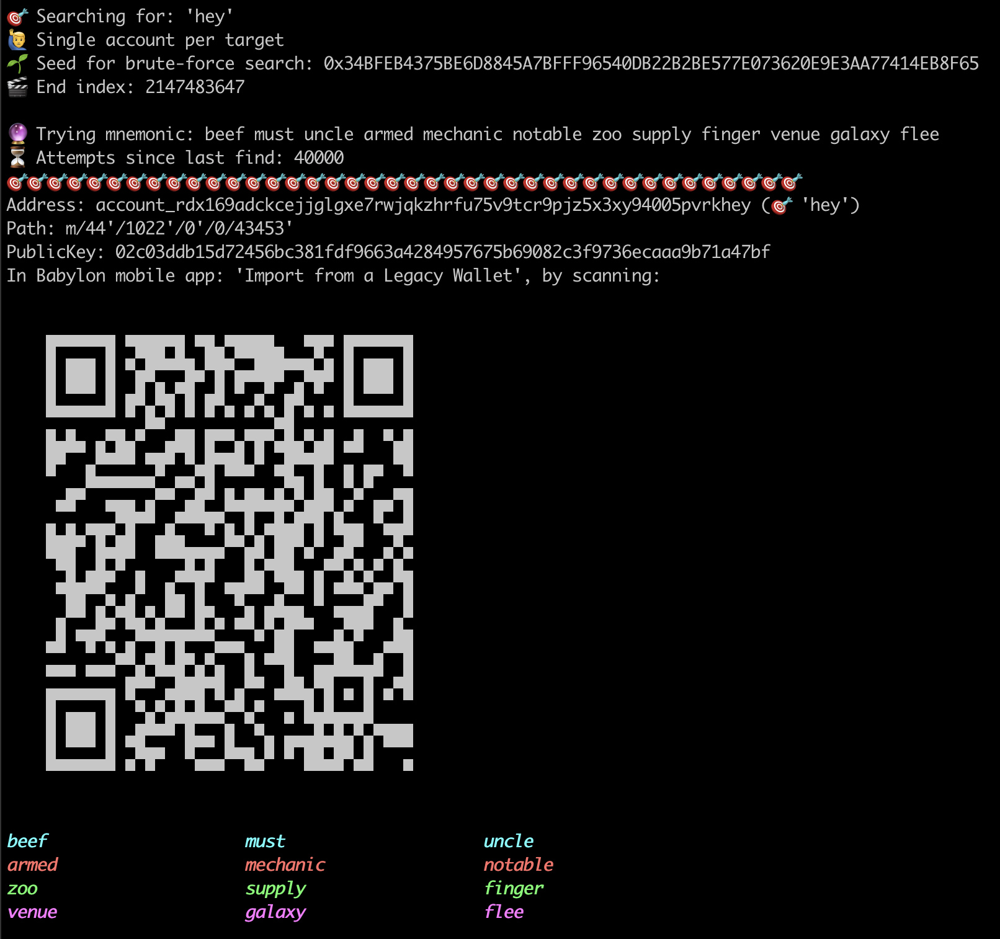

# Rad

Vanity address finder for Radix Babylon which you can import directly into your Radix Wallet using QR scanner using `Import from a Legacy Wallet` feature in App Settings.

# ⚠️ Disclaimer ⚠️

This software is NOT developed by, endorsed by or otherwise associated with Radix
Publishing, RDX Works or any entity related to Radix DLT.

The Radix mobile wallet 24 word seed phrase is much safer than the ones
generated by this software, which might be using INSECURE randomness.

You are responsible for retaining sole possession and ownership of, and for securing
the seed phrase(s) generated by this software.

# Demo

This demo demonstrates how I easily import a vanity account in the Radix Wallet using `Import from a Legacy Wallet` feature in App Settings, by scanning QR code shown by this software in CLI.

https://github.com/Sajjon/RadicalVanityRust/assets/864410/75725b18-6041-45a6-a29d-34d5cbaf214f

```sh
rad -t "hey"
```



The mnemonic is displayed in a 3x4 word coloured grid, after scanning QR input the mnemonic.

# Usage

## Help

```sh
rad --help
```

## Vanity address suffix targets as string

```
rad -p 0 -t "xx" | less
```

## Vanity address suffix targets from file

Or using a target suffixes file on format:

```plain
c00l
1337
```

```
rad -p 0 -f .suffixes.txt | less
```

If you name it `.suffixes.txt` it is already gitignored.

# Donate

If you've enjoyed this FREE software, please consider donating to:

```
account_rdx16xlfcpp0vf7e3gqnswv8j9k58n6rjccu58vvspmdva22kf3aplease
```

(yes it is an address ending with "please", generated by this software)


